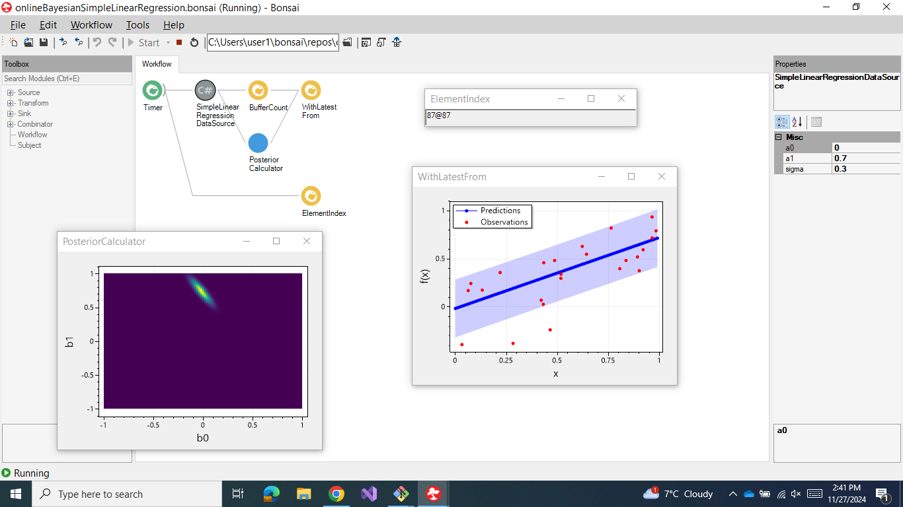

# Bonsai online Bayesian simple linear regression demo

To run this demo:

1. clone this repository
2. execute `bonsai-oblrSimpleLinearRegressionDemo/.bonsai/Setup.cmd`
3. run `bonsai-oblrSimpleLinearRegressionDemo.bonsai/Bonsai.exe`
4. in Bonsai open the workflow `bonsai-oblrSimpleLinearRegressionDemo/package/onlineBayesianSimpleLinearRegression.bonsai`
5. press the `Start` button in Bonsai

## Relevant source code

- [SimpleLinearRegressionDataSource](package/Extensions/SimpleLinearRegressionDataSource.cs)
- [PosteriorCalculator](https://github.com/joacorapela/bonsai-Bonsai.ML-OnlineBayesianLinearRegression/blob/master/code/src/PosteriorCalculator.cs)
- [BayesianLinearRegression.OnlineUpdate](https://github.com/joacorapela/bayesianLinearRegressionCSharp/blob/master/code/src/bayesianLinearRegression/BayesianLinearRegression.cs#L6)
